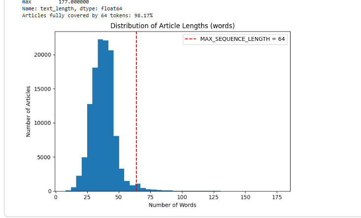
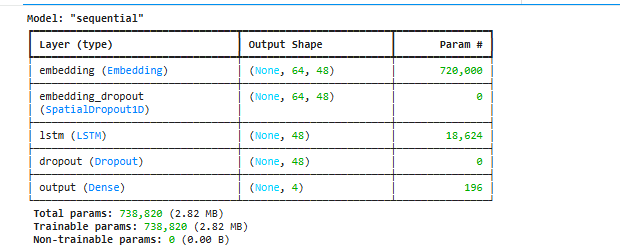
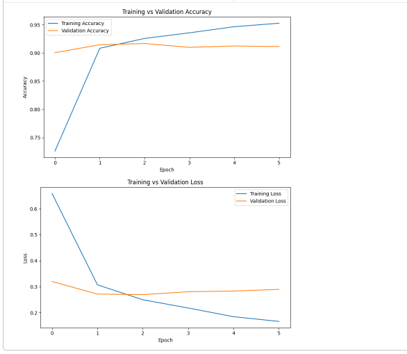
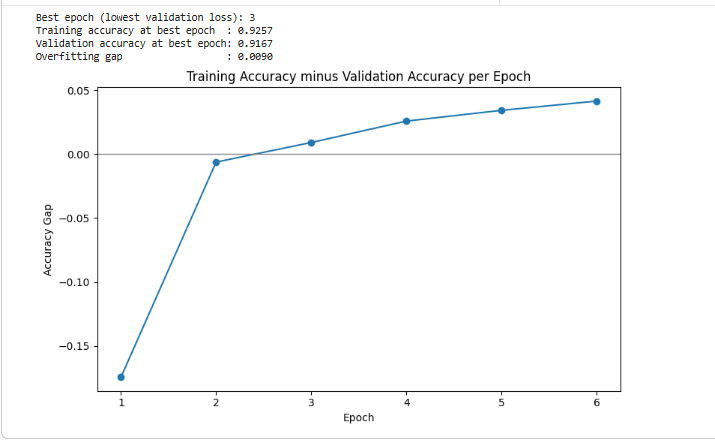
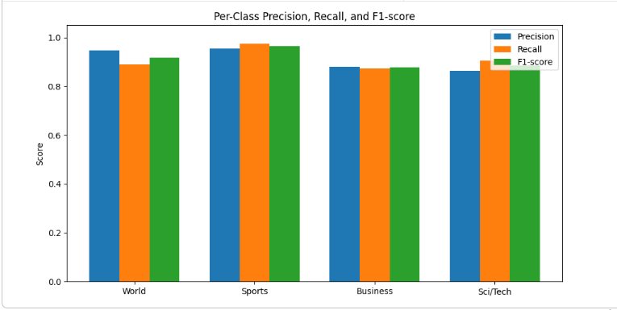
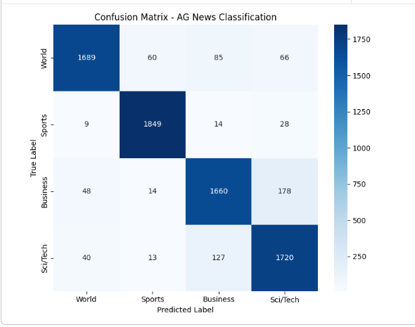
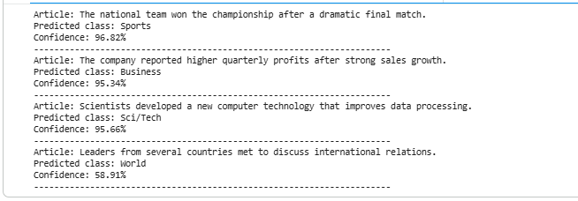

# AG News Classification Using Embedding Layer and LSTM

**Practical No. 02 – Text Classification using Embedding Layer and LSTM**

Multi-class text classification of news articles into **World, Sports, Business, Sci/Tech** using a Keras Embedding + LSTM network.

**Course:** Generative AI Lab | **Student:** Sakshi Uttam Walunj | **Class:** T.Y. B.Tech | **Department:** CSE (AI & ML)

---

## 1. Objective
Build a multi-class text classification model using an Embedding layer and LSTM network, and evaluate it using classification metrics. Pipeline: dataset loading → exploration → vectorization → model building → training with overfitting control → evaluation → prediction.

## 2. Dataset
**AG News**, loaded via Hugging Face `datasets`.

| Property | Value |
|---|---|
| Training articles | 120,000 |
| Test articles | 7,600 |
| Classes | 4 (balanced, 30,000 each) |

## 3. Preprocessing & Vectorization

64 tokens covers **98.17%** of articles (max 177 words), so sequence length was set to 64.

| Parameter | Value |
|---|---|
| Vocabulary size | 15,000 |
| Max sequence length | 64 tokens |
| Train / Val / Test split | 70,000 / 10,000 / 7,600 |

Vectorizer is fit only on training text — no leakage.

## 4. Model Architecture

Input → Embedding (masked) → SpatialDropout1D → LSTM → Dropout → Dense (Softmax)

| Layer | Config |
|---|---|
| Embedding | 48-dim, `mask_zero=True` |
| SpatialDropout1D | 0.30 |
| LSTM | 48 units, dropout 0.30 |
| Dropout | 0.50 |
| Dense | 4 units, softmax, L2 = 1e-4 |

**738,820 trainable parameters.**

### Overfitting-reduction steps
An earlier version hit 95%+ training accuracy while validation loss rose from epoch 2. Fixed by: smaller vocab/sequence length (20k→15k, 120→64), smaller Embedding/LSTM (64→48), added SpatialDropout1D + LSTM input dropout, raised output dropout (0.30→0.50) + L2, more training data (40k→70k), lower learning rate (0.0005) with `ReduceLROnPlateau`.

## 5. Training
Adam (lr=0.0005), sparse categorical crossentropy, batch size 64, max 12 epochs. `EarlyStopping` (patience 3, restore best weights) + `ReduceLROnPlateau`. Training stopped at **epoch 6**; best weights from **epoch 3**.

## 6. Overfitting Check

| Metric | Value |
|---|---|
| Best epoch | 3 |
| Train accuracy | 92.57% |
| Val accuracy | 91.67% |
| **Overfitting gap** | **0.90%** |

## 7. Test Results (7,600 unseen articles)

| Metric | Score |
|---|---|
| Test Accuracy | 91.03% |
| Macro Precision | 91.11% |
| Macro Recall | 91.03% |
| Macro F1 | 91.03% |

| Class | Precision | Recall | F1 |
|---|---|---|---|
| World | 0.9457 | 0.8889 | 0.9164 |
| Sports | 0.9551 | 0.9732 | 0.9640 |
| Business | 0.8802 | 0.8737 | 0.8769 |
| Sci/Tech | 0.8635 | 0.9053 | 0.8839 |

## 8. Confusion Matrix

Main confusion: **Business ↔ Sci/Tech** (178 + 127 cross-errors) — articles about tech companies/earnings genuinely span both topics. Sports is the cleanest class (F1 = 0.964).

## 9. Predictions on New Headlines

| Headline | Prediction | Confidence |
|---|---|---|
| "National team won the championship..." | Sports | 96.82% |
| "Company reported higher quarterly profits..." | Business | 95.34% |
| "Scientists developed new computer technology..." | Sci/Tech | 95.66% |
| "Leaders met to discuss international relations." | World | 58.91% |

Lower confidence on the last example reflects genuine sentence ambiguity, not a model flaw.

## 10. Project Structure

Practical-2/
├── Practical_2_Text_Classification_using_Embedding_Layer_and_LSTM.ipynb
├── README.md
├── ag_news_lstm_model.keras
├── ag_news_vectorizer_vocab.txt
└── Screenshots/
├── 01_text_length_distribution.PNG
├── 02_model_summary.PNG
├── 03_accuracy_loss_curves.PNG
├── 04_overfitting_gap.PNG
├── 05_confusion_matrix.PNG
├── 06_classification_report.PNG
└── 07_sample_prediction.PNG

## 11. Requirements & How to Run

pip install datasets tensorflow pandas numpy matplotlib seaborn scikit-learn

Run on Google Colab: upload notebook → Run all → dataset downloads automatically via `datasets` library. TensorFlow 2.21.

## 12. Key Learning Outcomes
Text preprocessing, `TextVectorization`, Embedding representations, LSTM sequence modelling, dropout/L2 regularization, softmax multi-class classification, early stopping, learning-rate scheduling, overfitting diagnosis, precision/recall/F1 (macro), confusion matrix interpretation, inference on new text.

## 13. Conclusion
The model achieves **91.03% test accuracy** and **macro F1 of 0.9103**, with an overfitting gap of only **0.90%** between train and validation accuracy at the best epoch. Errors concentrate between Business and Sci/Tech due to genuine topical overlap.

## 14. Author

**Sakshi Uttam Walunj** | T.Y. B.Tech – CSE (AI & ML) | Generative AI Lab

**GitHub:** https://github.com/Sakshiwalunj5/GenAI/tree/main/Practical-2
